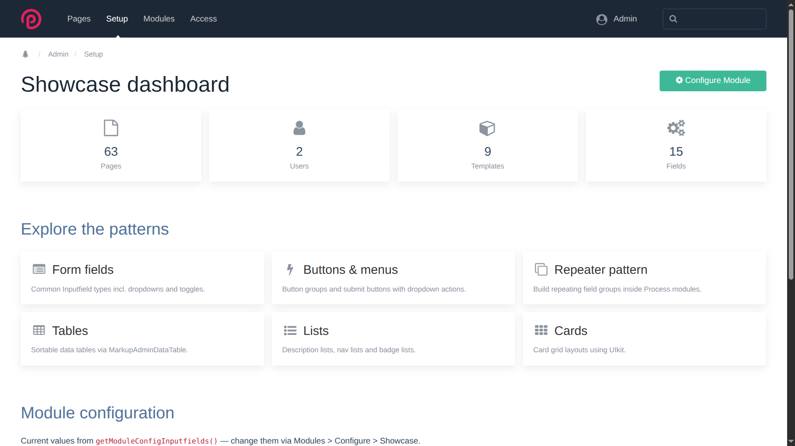

# ProcessShowcase

ProcessShowcase is a demonstration module for the ProcessWire admin. It brings
common admin interface elements together in one place so you can see how they
look, how they behave and how they respond to your admin theme.

The module is useful when you are:

- building or testing a ProcessWire admin theme;
- checking how controls behave in light and dark mode;
- comparing different form fields and page selectors;
- testing files, images, repeaters, tables, lists, cards and dialogs;
- looking for a working example before building your own admin page.

It is a reference and testing tool. It does not add features to the public side
of your website.

## Requirements

- ProcessWire 3 or newer
- PHP 8 or newer
- Superuser access to the ProcessWire admin

## Installation

1. Copy the `ProcessShowcase` folder into `site/modules/`.
2. In the ProcessWire admin, go to **Modules > Refresh**.
3. Find **Showcase** and click **Install**.
4. Open **Setup > Showcase**.

The module creates the admin page and the private test data needed by some of
its examples.

## How to use it

Open **Setup > Showcase**. The dashboard links to focused pages for different
parts of the ProcessWire admin interface.

- **Basic inputs** shows number, date, time and utility fields.
- **Selection controls** shows selects, page selectors and related controls.
- **Page references** compares the available ways to choose existing pages.
- **Text & editors** shows text fields, language tabs and rich-text editors.
- **Checkboxes, radios & toggles** lets you compare choice controls.
- **Buttons & action menus** shows buttons, grouped actions and dropdowns.
- **Files & images** provides real upload, description, sorting and image tools.
- **Repeaters** lets you add, remove and reorder rows.
- **Tables, Lists and Cards** show common ways to present admin content.
- **HTML elements** provides a broad set of standard elements for theme testing.
- **PageList states** shows common page statuses and actions.
- **Notices & dialogs** demonstrates messages, confirmations and modals.

You can freely interact with the examples. Most form submissions simply show
the submitted values and do not permanently store them.

## Saved test data

The Repeater and Files & images pages are different: ProcessWire needs saved
pages and fields for these controls to work normally. ProcessShowcase creates
its own private test records for them.

Files, images, descriptions, ordering and repeater items are kept when you save
their forms, so you can reload the page and continue testing. This data belongs
only to ProcessShowcase and is not connected to your website content.

## Configuration

Open the **Showcase** module in **Modules** to change its example settings,
including the maximum number of repeater items. These settings exist only to
demonstrate a module configuration screen.

## Uninstallation

Uninstall **Showcase** from the ProcessWire module screen when you no longer
need it. Uninstallation removes the Showcase admin page and all private test
data created by the module, including uploaded files, images and generated image
variations.

Do not store anything important in the Showcase examples.

## Technical reference

Implementation details for developers and coding agents are kept in
[DEVELOPMENT.md](DEVELOPMENT.md).
